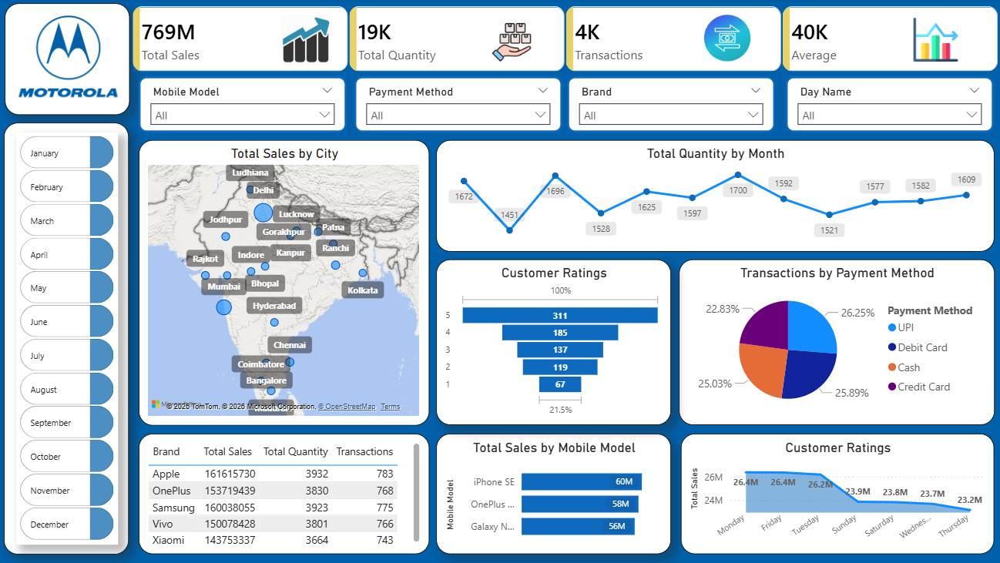

# Mobile-Sales-Dashboard

## 1. Project Title
**📊 Mobile Sales Analytics: Multi-Brand Performance & Customer Insights Dashboard** :
An interactive Power BI dashboard designed to analyze mobile phone sales across brands, cities, time periods, and payment methods—helping businesses understand sales performance, customer behavior, and market trends.

## 2. Short Description 
The **Mobile Sales Analytics Dashboard** is a comprehensive Power BI report that provides insights into mobile phone sales across multiple brands and models. It enables stakeholders to monitor revenue, sales volume, transactions, customer ratings, and payment preferences across cities and time periods for data-driven decision-making.

## 3. Tech Stack
The dashboard was built using the following tools and technologies:

* 📊 **Power BI Desktop** – Core data visualization and dashboard development tool
* 📂 **Power Query** – Used for data cleaning, transformation, and preprocessing
* 🧠 **DAX (Data Analysis Expressions)** – Created calculated measures for KPIs such as total sales, average sales, and transaction metrics
* 📁 **Data Source Structure** – Single flat table containing sales, customer, product, and transaction attributes
* 📄 **File Format** – `.pbix` for development and `.png` for dashboard previews

## 4. Data Source

**Source:** Practice mobile sales dataset

The dataset contains sales records of mobile phones across multiple brands and models, including:

* Brand and mobile model
* Sales amount and quantity sold
* Transaction details
* Payment methods (UPI, Debit Card, Credit Card, Cash)
* Customer ratings
* City-level sales data
* Date attributes (month, day)

This structure allows detailed analysis across geography, time, customer satisfaction, and payment behavior.

## 5. Features / Highlights

### • Business Problem

Mobile retailers and analysts often struggle to quickly answer key questions such as:

* Which mobile brands and models generate the highest revenue?
* Which cities contribute most to sales?
* How do sales vary by month and day?
* What payment methods do customers prefer?
* How do customer ratings impact sales performance?

Raw transactional data makes these insights difficult to identify without an analytical layer.

---

### • Goal of the Dashboard

The goal of this dashboard is to:

* Provide a **centralized view of mobile sales performance**
* Enable **brand, city, and time-based comparisons**
* Identify **top-selling models and customer preferences**
* Support **business, marketing, and inventory decisions**
* Deliver insights in a **clear, interactive, and visually engaging format**

---

### • Walkthrough of Key Visuals

#### 🔹 Key KPIs (Top Section)

* **Total Sales:** 769M
* **Total Quantity Sold:** 19K units
* **Total Transactions:** 4K
* **Average Sales Value:** 40K

These KPIs provide a quick executive snapshot of overall performance.

---

#### 🔹 Interactive Filters & Slicers

* Mobile Model
* Brand
* Payment Method
* Day Name
* Month Selector (January–December)

All visuals dynamically update based on selected filters.

---

#### 🔹 Total Sales by City (Map Visual)

* Geographic distribution of sales across major Indian cities such as Mumbai, Delhi, Bangalore, Chennai, Hyderabad, Kolkata, etc.
* Helps identify **high-revenue regions and emerging markets**.

---

#### 🔹 Total Quantity by Month (Line Chart)

* Displays monthly sales quantity trends.
* Useful for **seasonality analysis** and identifying peak sales periods.

---

#### 🔹 Transactions by Payment Method (Donut Chart)

* Breakdown of transactions across:

  * UPI
  * Debit Card
  * Credit Card
  * Cash
* Highlights customer payment preferences and digital adoption trends.

---

#### 🔹 Customer Ratings Distribution ( Funnel Visual)

* Shows how customers rate their purchases (1–5 scale).
* Enables analysis of **customer satisfaction patterns**.

---

#### 🔹 Total Sales by Brand (Table)

* Comparison of major brands such as:

  * Apple
  * Samsung
  * OnePlus
  * Vivo
  * Xiaomi
* Metrics include:

  * Total Sales
  * Total Quantity
  * Total Transactions

---

#### 🔹 Total Sales by Mobile Model (Bar Chart)

* Identifies top-performing mobile models such as:

  * iPhone SE
  * OnePlus models
  * Samsung Galaxy models
* Useful for **product-level performance analysis**.

---

#### 🔹 Sales by Day of the Week (Area / Line Chart)

* Tracks sales trends across weekdays.
* Helps businesses optimize **promotions and staffing strategies**.

---

### • Business Impact & Insights

* **Sales Optimization:** Identify top brands and models driving maximum revenue
* **Market Analysis:** Understand city-wise demand and regional performance
* **Customer Behavior:** Analyze payment preferences and rating trends
* **Inventory Planning:** Forecast demand using monthly and daily sales patterns
* **Strategic Decisions:** Support pricing, marketing, and expansion strategies

---

## 6. Snapshot of Dashboard

📸 *Dashboard Preview:*

---

